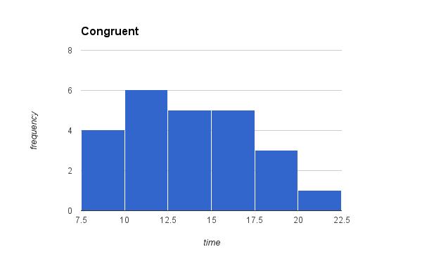
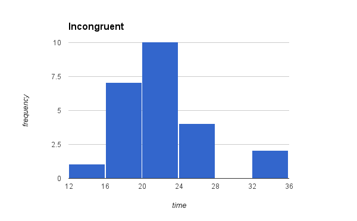

# Statistics: The Science of Decisions

## Background Information
In a Stroop task, participants are presented with a list of words, with each word displayed in a color of ink. The participant’s task is to say out loud the color of the ink in which the word is printed. The task has two conditions: a congruent words condition, and an incongruent words condition. In the congruent words condition, the words being displayed are color words whose names match the colors in which they are printed: for example RED, BLUE. In the incongruent words condition, the words displayed are color words whose names do not match the colors in which they are printed: for example PURPLE, ORANGE. In each case, we measure the time it takes to name the ink colors in equally-sized lists. Each participant will go through and record a time from each condition.


### 1. What is our independent variable? What is our dependent variable?

Independent variable is color of ink in two conditions: a congruent words condition, and an incongruent words condition.
Dependent variable is time it takes to name the ink colors.

### 2. What is an appropriate set of hypotheses for this task? What kind of statistical test do you expect to perform? Justify your choices. 

The null hypothesis is means of populations from each condition is same.
The alternative hypothesis is means of populations from each condition is not same or time of a congruent words condition is less than the other condition.
(Note: mu_con is the congruent population means and mu_incon is the incongruent population means)
- H0 : mu_con = mu_incon
- HA : mu_con < mu_incon

I would perform dependent t-test for paired samples. First of all, we need to compare the Stroop task in two conditions, and two samples are given which are dependent. Same participants, the subjects, took the Stroop task twice under different conditions. Second, the population standard deviation is unknown and the sample size is below 30. Based on the hypothesis, I will conduct an one-tailed t-test. Because I'm looking for an effect in a positive direction. I expect participants spend less time in the congruent condition. 

### 3. Report some descriptive statistics regarding this dataset. Include at least one measure of central tendency and at least one measure of variability.

<pre>
```
|----------------------------------------------------------------------------------|-----------------------------------|---------------------------------------|
|                                                            | Congruent task   | Incongruent task   |
|----------------------------------------------------------------------------------|-----------------------------------|---------------------------------------|
|   N                                                       |                     24|                         24|
|----------------------------------------------------------------------------------|-----------------------------------|---------------------------------------|
|   Mean                                                 |                 14.05|                   22.01|
|----------------------------------------------------------------------------------|-----------------------------------|---------------------------------------|
|   Standard deviation of the differences  |                                                4.86 |
|----------------------------------------------------------------------------------|-----------------------------------|---------------------------------------|
```
</pre>

### 4. Provide one or two visualizations that show the distribution of the sample data. Write one or two sentences noting what you observe about the plot or plots.

I provide two visualization of congruent and incongruent conditions. The sample data of each condition is approximately normal distributions. Graph of Incongruent condition shows that it is more spread out than congruent condition.




### 5. Now, perform the statistical test and report your results. What is your confidence level and your critical statistic value? Do you reject the null hypothesis or fail to reject it? Come to a conclusion in terms of the experiment task. Did the results match up with your expectations?

- One-tailed t-test (95% CI, that is alpha = .05)
- Degree of freedom = 23
- t-critical value = 1.714
- t-statistics = 8.02

Based on the t-statistics and t-critical value, the results are statistically significant. So, I reject the null hypothesis because p < 0.05.
